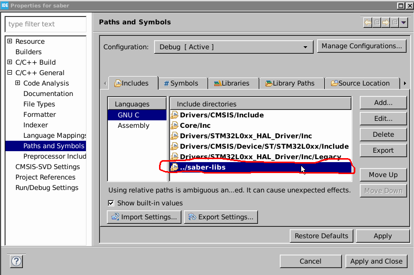
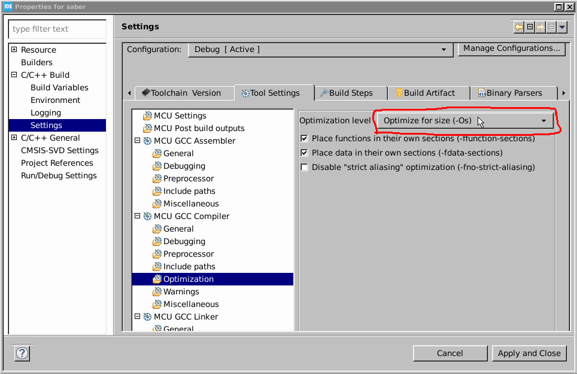
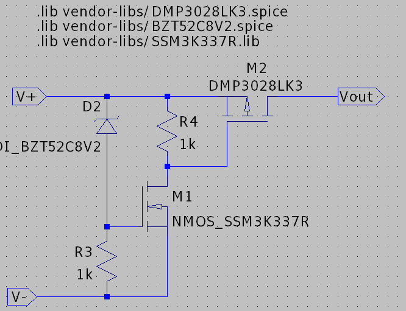
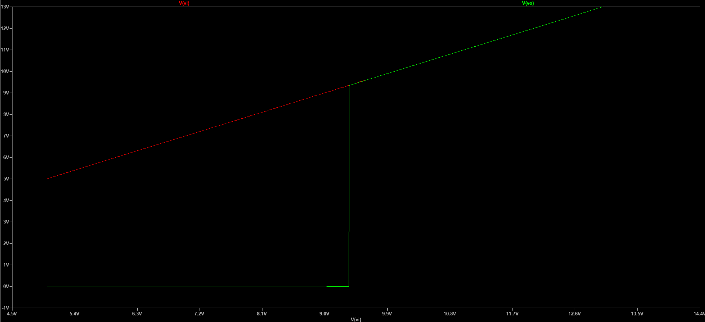
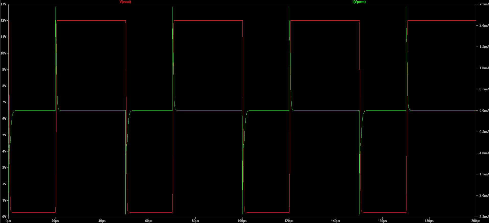

# kyber
The toy lightsaber I always wanted as a kid.

## Status
* KyberBoard Rev 1 sent out for fabrication.
* Found Luke Skywalker lightsaber CAD for 3D printing by [CaseStudyno8](https://www.thingiverse.com/thing:1263192/files).
* Circuit design complete and subcircuit interfaces frozen.
* Subcircuits passed breadboard feasibility tests.
* First pass on firmware architecture complete.

## Goals
- Build a lightsaber that extends/retracts, lights up, and makes sound
- Demonstrate "full-stack" electronics engineering skills + some mechanical design
- Stay sane for the rest of the pandemic (everyone needs a hobby)
- Maybe have a Luke Skywalker costume by Halloween 2021?

## [fw](fw/)
Written for the [STM32L051K8T6](hw/KyberBoard/symbol-datasheets/stm32l051t8.pdf) microcontroller. Code should work on any STM32 micrcontroller, and most interfaces are abstracted into header files.

TODO: state diagram

### Configuring STM32CubeIde
Edit project settings to include the multi-project libraries and make the compiler optimize for size. TODO: change saber-libs to holocron-libs

## [hw](hw/)
A mildly overdesigned PCB to allow flexibility in mechanical design. Designed for test, assembly, and reconfigurability.

### Component Selection Rules
Keep It Simple, Stupid. Stick to driving circuits that have readily available and easily solderable components. If necessary, target components that have in-stock evaluation boards and take the scrap.

### Current (A) Budget
|Component  |Amperage  |Reasoning                        |
|-----------|----------|---------------------------------|
|motor      |10A       |stall current of on-hand dc motor|
|solenoid   |1A        |12 V/13 Ohms rounded up          |
|3V3 bus    |1A        |typical LDO rating               |
|waste      |0.5A      |safety factor                    |
|-----------|----------|---------------------------------|
|total      |12.5A     |                                 |

### Voltage Loss Budget
Mostly concerned with battery protection I2R losses. Target < 0.5V peak drop (instinctive spec, not computed)

Major concerns are
- falling below the solenoid turn-on voltage, although I haven't _really_ settled on a solenoid
- throwing off motor control

Current resolution: use ST's [VNHD7008AY eval board example design](reference-manuals/en-vnhd7008ay.pdf). It seems to work fairly well

### Subcircuits
#### Reverse Polarity Protection
Use the built-in protection of the hbridge. Need to characterise I2R losses. This will help prevent the Big DumbTM since I plan to use terminal blocks for my main connector.
#### Low-Voltage Shutoff
Grocery store batteries can't drive the actuators, so I'm looking at using a LiPo. This simple Zener-NMOS-PMOS circuit I designed for a student club will should prevent battery over-discharge.

When the voltage is above Vthresh, the Zener conducts, so the NMOS conducts, which makes the PMOS conduct.
#### 3V3 Bus
LDO; I do not want to deal with buck converters. I am not being paid for this design.
#### Accelerometer/Gyro
For that sweet, sweet _zwoom_. Use I2C/SPI to make routing a little easier. I have a still-in-stock breakout board for the no-longer-produced [MMA84252QT](https://www.digikey.com/catalog/en/partgroup/mma8452q/11242).
#### Motor Current Sensing
I may use torque control to retract the saber. Currently planning to extend it with a spring, so the "retracted torque" is theoretically better characterized than the "retracted position".
#### HBridge
I found a high-current hbridge IC that does not require complementary PWM (thank you ST). I have limited PWM capabilities due to only low-power ST micros being in stock.
#### Actuators
Low-side switches that do not require inrush-limiting resistors to reduce component count. The [SSM3K337R,LF](https://www.digikey.com/en/products/detail/toshiba-semiconductor-and-storage/SSM3K337R-LF/5056502?s=N4IgTCBcDaIMpwLIGYDSzkHYBKIC6AvkA) stays well under the maximum drive current and well-preserves a 20kHz square wave.

### Non-electrical considerations
- Cost: 4 layers. 2-sided board gives me the needed density, and routing isn't that awful
- I'm not sure I want to hand-solder QFN packages
- Size: Maximize density to maximize mechanical design flexibility.
- Power budget: Meh, I can increase resistances after fab if it's a battery killer

## [cad](cad/)
Found a Luke Skywalker lightsaber CAD for 3D printing by [CaseStudyno8](https://www.thingiverse.com/thing:1263192/files). Was also pointed to Disney's [new lightsaber](https://mashable.com/article/real-lightsaber-star-wars-hotel-disney-world/), which shows some novel mechanical design for retraction. Although I would prefer to be able to fence with my design, the tape measure strategy does show promise.
